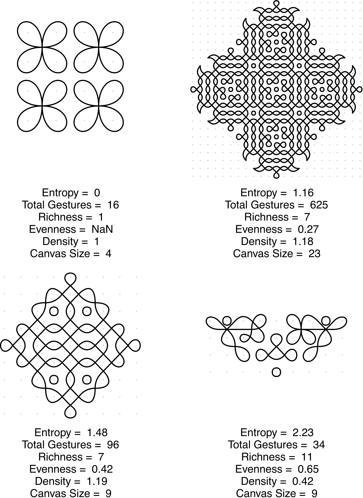

[](https://creativecommons.org/licenses/by/4.0/)

# Entropy trade-offs in artistic design: A case study of Tamil *kolam*

The following repository contains data and code used for analyses in:

> Tran, N.-H., Atmaca, S., Waring, T. & Beheim, B. A. (submitted). Entropy trade-offs in artistic design: A case study of Tamil *kolam*.

## Getting Started

These instructions will get you a copy of the project up and running on your local machine. 

### Prerequisites

In order to be able to run the code, you will need to have an up-to-date version of [R](https://www.r-project.org/) installed on your computer and a few CRAN packages (see below). You will need [Stan](https://mc-stan.org/) in order to fit the statistical models. To be able to plot the *kolam* drawings, you will further need to install the `kolam` R package.

```
# Install devtools package if necessary
if(!"devtools" %in% rownames(installed.packages())) install.packages("devtools")

library(devtools)
Sys.setenv("R_REMOTES_NO_ERRORS_FROM_WARNINGS"=TRUE)
devtools::install_github("rmcelreath/rethinking")

# Install required packages
install.packages(c("rstan", "ggpubr", "dplyr", "msm", "ggplot2", "ggdag", "parallel", "tictoc", "patchwork", "ggridges", "ks", "concaveman", "igraph", "tidyverse", "Rsolnp", "gtools"))

# Install the stable development version of the kolam package
devtools::install_github("nhtran93/kolam")

# Install the stable development of kernelgon to create Figure 4 in the manuscript
Sys.setenv("R_REMOTES_NO_ERRORS_FROM_WARNINGS"=TRUE)
devtools::install_github("babeheim/kernelgon")
```

### Data & Samples
The [data](data/) to run the analyses can be found all in `data/kolam_data_share.RData` or in form of a .csv file. To get the full sample object for each model, you will have to fit the statistical models.

### Structure of the Repository
`data/`: Contains the data.  
`output/`: Figures and posterior samples will be stored in this directory.  
`helpers/`: Contains all the helper functions for the analyses.  
`stan/`: Contains the Stan code for the random intercept model.  

## Run the analyses
Download all files from https://github.com/nhtran93/kolam_signaling

If you use R, please set the working directory to the appropriate directory where you have saved these files. If you use RStudio, you can just open the respective RStudio project and the directory will be automatically set.

Some example kolam transcription files are in the repository in form of .yaml files. Code for all the figures in the manuscript can be found [here](Explore_data.R).

Before fitting the statistical models, you will first need to check your directory:
```
# Make sure to check your working directory first. You should be in the root directory of this project. 
getwd()

# Example of how to fit a statistical model (change the if statement to TRUE):
density_model <- FALSE
gini_model <- TRUE          # This model will be fitted
unique_model <- FALSE
canvas_size_model <- FALSE
entropy_model <- FALSE

```
**IMPORTANT NOTE**: Make sure you have enough disk space and working memory left on your computer. The statistical models take a while (~2h each) to run and the samples are each up to 2GB big. It is recommended to run the statistical models on a cluster computer if possible.

You can run fit the statistical models one by one using the R script [Fit_models_intecept.R](Fit_models_intecept.R) to run the random incetercept models. The code chunks to fit the statistical models are each wrap in an if statement. The default of the if statement is FALSE. If you want to fit the statistical model, you will have to manually change the if statement into TRUE on the top of the R script. The samples should be stored in the your current directory. Afterwards, you can [describe](Describe_model_samples.R) the models and run diagnostic plots (Figures shown in the main paper). The plots will be automatically saved in your current directory.

You can further find the code to run the simulations to solve for the *entropy envelope* in terms of boundary conditions and reproduce the SI Figure 1 in [entropy_evenness_richness_simulation.R](entropy_evenness_richness_simulation.R). 

### Example *kolam* drawings and their corresponding structural and information-theoretic properties



## Authors

* **[N.-Han Tran](https://www.eva.mpg.de/ecology/staff/han-tran/index.html)**
* [Silke Atmaca](https://www.eva.mpg.de/ecology/staff/silke-atmaca/index.html)
* [Timothy Waring](https://timwaring.info/)
* [Bret A. Beheim](https://www.babeheim.com/)


## License

This project is licensed under the CC-BY-4.0 License - see the [LICENSE.md](LICENSE.md) file for details.
